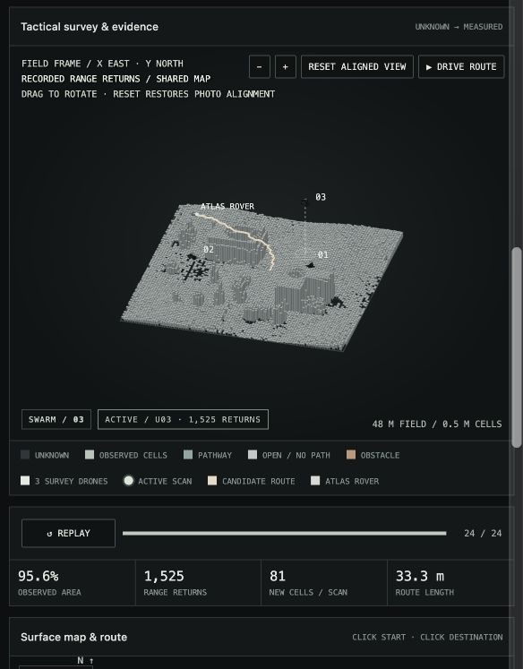

# ATLAS

ATLAS is a local app for looking at terrain and finding a possible rover route.

It runs on your computer. It does not control real drones or a real rover.



*Recorded synthetic demo: three drones, 95.6% observed coverage, and a candidate route. These are simulation results.*

## What it can do

- Show a terrain map and a 3D view.
- Show six simulated drones surveying an uploaded image, or replay a three-drone synthetic survey.
- Let you choose a start and end point.
- Find a route with the A* pathfinding algorithm.
- Highlight unclear parts of a route and check them again.
- Open local point-cloud files: XYZ, CSV, TXT, and ASCII PLY.
- Download the route as a JSON file.

## Start the app on Mac or Linux

In Terminal, run:

```bash
python3 -m venv .venv
.venv/bin/python -m pip install -e ".[field]"
bash run.sh swarm --out output/swarm
bash run.sh field-server --port 8767
```

Then open [http://127.0.0.1:8767](http://127.0.0.1:8767) in Safari.

## Start the app on Windows

In PowerShell, run:

```powershell
py -m venv .venv
.\.venv\Scripts\python.exe -m pip install -e ".[field]"
.\.venv\Scripts\python.exe -m sentinel swarm --out output/swarm
.\.venv\Scripts\python.exe -m sentinel field-server --port 8767
```

Then open [http://127.0.0.1:8767](http://127.0.0.1:8767).

## Optional: use an aerial image

To analyse an aerial image with a pretrained model, run:

```bash
.venv/bin/python -m pip install -e ".[vision]"
.venv/bin/python scripts/fetch_aerial_model.py
```

The model can label parts of an image, such as roads, trees, water, and buildings. It does not measure real height or prove that a route is safe.

The model is the pretrained `mfaytin/mask2former-satellite` Mask2Former checkpoint, run locally with PyTorch. ATLAS integrates inference; it does not train or fine-tune this model. Regional inspection runs inference again on image crops. Accuracy on a custom outdoor dataset has not been established.

## Check the code

Install Node.js to run the browser checks.

```bash
make test
make field
```

## Important limits

- The drones and rover are visual simulations.
- The route is a demo result. Do not use it to drive a real rover.
- Point clouds come from files you add. ATLAS does not connect to live sensors.

## Presenting ATLAS

Suggested description: “Integrated local PyTorch semantic segmentation inference into a terrain-analysis and route-planning workflow.”

See [the demo steps](docs/DEMO.md) and [verification details](docs/VERIFICATION.md). Open3D processing, SQLite experiment records, and the C++ terrain tool are separate command-line components; uploading points in the browser uses the JavaScript importer.
