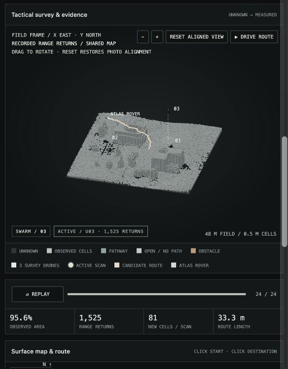

# ATLAS

ATLAS is a local terrain-perception and route-planning prototype. It uses a pretrained
PyTorch segmentation model to identify terrain classes in an aerial image, converts
those predictions into a traversability map, and uses A* search to calculate a
candidate rover route around predicted obstacles.



*Recorded synthetic terrain survey with a candidate route. This is a simulation result.*

## What happens in the browser demo

1. You upload an aerial image.
2. A pretrained Mask2Former model runs locally through PyTorch and predicts road,
   open ground, vegetation, forest, water, and building classes.
3. ATLAS turns the predictions into a grid. Roads are preferred, open ground has
   a higher cost, and predicted buildings, water, and dense forest are blocked.
4. The survey animation gradually reveals this grid.
5. You choose a start and destination. A* searches the grid and draws a candidate route.
6. Route inspection can run the model again on selected image regions and then replan.
7. A rover animation plays back the calculated route.

The aircraft animation represents a survey. It does not collect physical measurements.

## Start the app on Mac or Linux

In Terminal, run:

```bash
python3 -m venv .venv
.venv/bin/python -m pip install -e ".[field]"
bash run.sh swarm --out output/swarm
bash run.sh field-server --port 8767
```

Then open [http://127.0.0.1:8767](http://127.0.0.1:8767) in Safari.

## Start the app on Windows

In PowerShell, run:

```powershell
py -m venv .venv
.\.venv\Scripts\python.exe -m pip install -e ".[field]"
.\.venv\Scripts\python.exe -m sentinel swarm --out output/swarm
.\.venv\Scripts\python.exe -m sentinel field-server --port 8767
```

Then open [http://127.0.0.1:8767](http://127.0.0.1:8767).

## Optional: use an aerial image

To analyse an aerial image with a pretrained model, run:

```bash
.venv/bin/python -m pip install -e ".[vision]"
.venv/bin/python scripts/fetch_aerial_model.py
```

The model can label parts of an image, such as roads, trees, water, and buildings. It does not measure real height or prove that a route is safe.

The model is the pretrained `mfaytin/mask2former-satellite` Mask2Former checkpoint, run locally with PyTorch. ATLAS integrates inference; it does not train or fine-tune this model. Regional inspection runs inference again on image crops. Accuracy on a custom outdoor dataset has not been established.

## Check the code

Install Node.js to run the browser checks.

```bash
make test
make field
```

## Technology

- **Python** runs the backend, data processing, command-line tools, and tests.
- **PyTorch and Mask2Former** run pretrained semantic-segmentation inference locally.
- **FastAPI** serves the browser app and image-analysis endpoints.
- **JavaScript and HTML Canvas** provide the terrain view, survey animation, and route interaction.
- **A\*** searches the traversability grid for a candidate rover route.
- **NumPy** stores elevation, semantic, and traversability grids.
- **GitHub Actions** runs the automated Python, JavaScript, and C++ checks.

The repository also contains separately tested command-line components: **Open3D**
point-cloud processing, **SQLite** experiment records, and a **C++17** elevation-grid
step/slope analyzer. The browser does not call these three components during its normal
image-upload workflow.

## Important limits

- The aircraft and rover are visual simulations.
- The route is a demo result. Do not use it to drive a real rover.
- Point clouds come from files you add. ATLAS does not connect to live sensors.
- The pretrained model was integrated, not trained or fine-tuned in this project.
- Model accuracy has not been established on a custom outdoor dataset.

## Presenting ATLAS

Suggested description: “Integrated local pretrained PyTorch semantic segmentation into a terrain-analysis and A* route-planning workflow.”

See [the demo steps](docs/DEMO.md) and [verification details](docs/VERIFICATION.md). Open3D processing, SQLite experiment records, and the C++ terrain tool are separate command-line components; uploading points in the browser uses the JavaScript importer.
